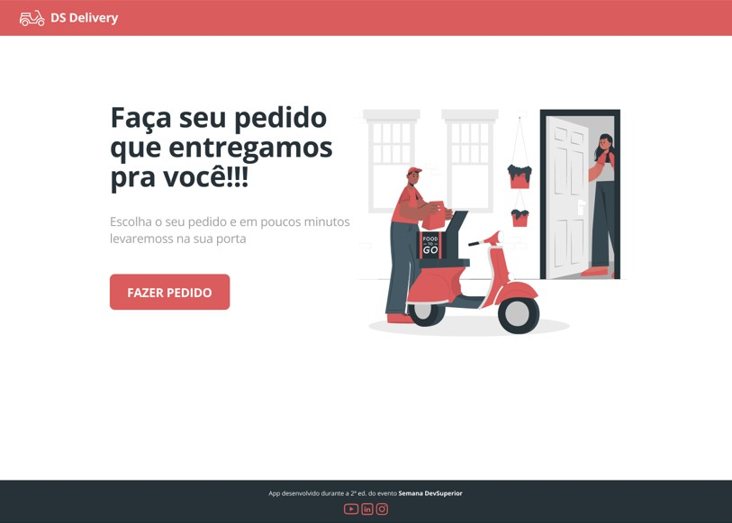
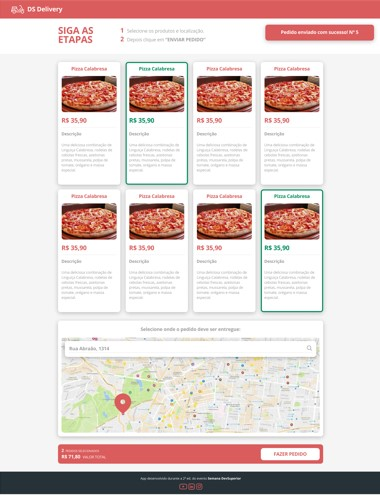
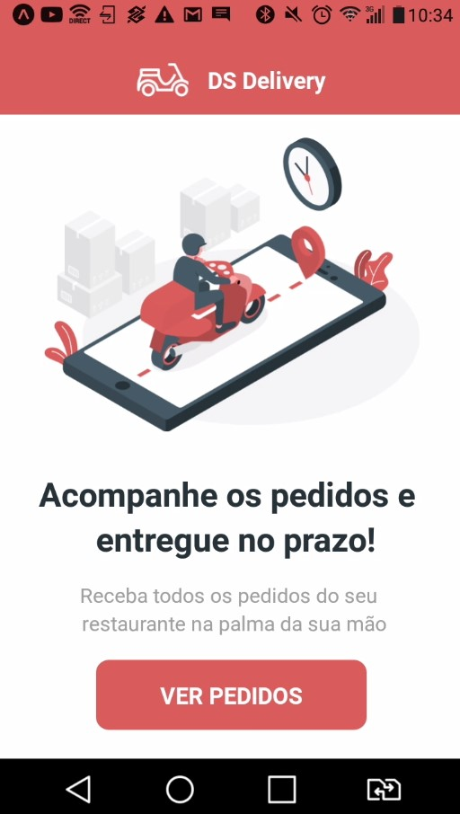
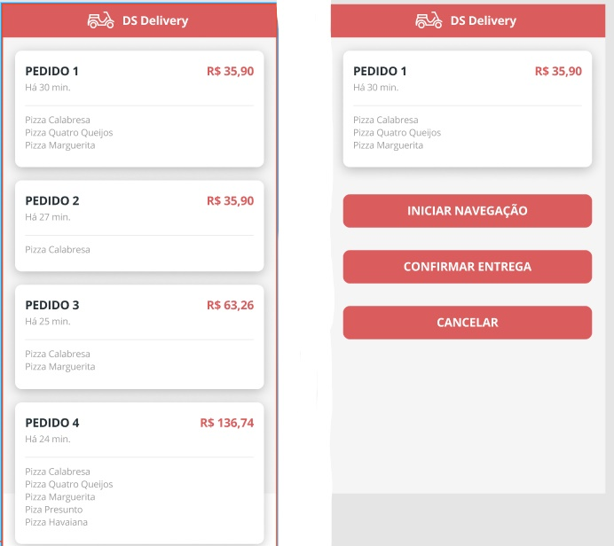

## Dsdeliver-sd2

## Sobre

O projeto é uma aplicação de pedidos, com uma tela inicial de boas vindas e logo depois uma tela com a listagem de produtos onde poderam ser feitos pedidos
e escolher a localização para entrega destes pedidos.
Já na aplicação mobile do projeto, terá uma tela inicial de boas vindas, uma outra tela que terá uma listagem com todos pedidos efetuados onde poderá selecionar
um determinado pedido que abrirá uma tela com as opções de cancelar o pedido, iniciar a navegação para entrega do pedido e também confirmar a entrega do pedido.  

## Informações adicionais

O projeto foi criado com a ferramenta do spring Initializr, dependêcia maven, linguagem java e typeScript. Foi utilizado a base de dados Postgres local para 
armazenamento de dados.
O bild deste projeto foi implantado no heroku de forma automatizada. O back end se comunica com o front end por meio do protocolo http e possui 3 camadas
básicas: - Controladores Rest
         - Camadas de serviço
         - Camadas de acesso a dados.
O front end faz requisições com o back end pelo protocolo da internet http : Rest/Json.         

## Layout front-end

  
         
    

## Layout mobile

         
     

         

## Como execultar o projeto

Este projeto foi desenvolvido no heroku no plano gratuito de hospedagem. Por ser um plano gratuito o limite de acesso e bastante limitado. E possível que no momento do 
acesso o plano já tenha atingido o limite permitido de visualizações e não mostre todas as funcionalidades do aplicativo. Esta restrição pode estar também vinculada 
ao aplicativo mobile e não mostrar alguma das funcionalidades do aplicativo no celular. Link do aplicativo: https://charliston-sds2.netlify.app 
Não conseguindo acessar o aplicativo pelo link, clone o projeto e na pasta do projeto web, abra o terminal e execulte o comando npm start.

### Par visualizar a execução do aplicativo web

Clone o projeto em sua maquina, entre na pasta do projeto e pelo terminal execulte o comando npm start.

### Para visualizar a execução do aplicativo mobile

Baixe o aplicativo do expo em seu dispositivo móvel. Para execultar o projeto basta importa-lo no vsCode e execultar o comando expo start na pasta do projeto. Selecione a opção tunel na tela que abrir no navegador, isso vai gerar um qrCode. Com o expo aberto em seu dispositivo móvel clique em qrCode para ler o qrCode que abrir na tela do computador.
Isso permitira a execução do aplicativo em seu dispositivo móvel.
